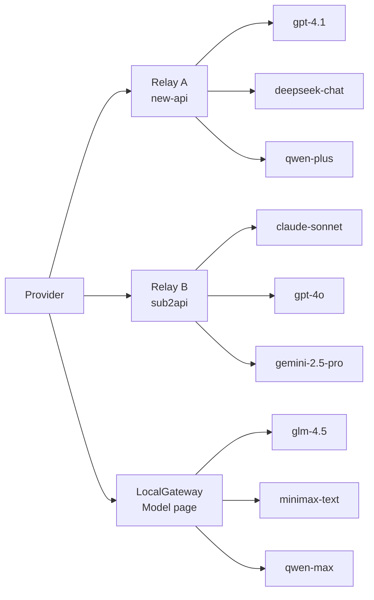

# What Is The Difference Between Provider And Model In Relay Switch?

Why does the product have both a Provider page and a Model page?

In one sentence: Provider manages relay services, while the Model page is a local relay service, LocalGateway.

Architecturally, you can read it like this:



Both pages look related to "models", but they solve different problems.

Simply put:

Provider means "which API service do I go out through?"

Model means "which native model sources do I manage locally?"

If these two concepts are not separated, the first impression may feel simpler, but the product becomes more confusing as it grows.

For example, suppose you have a relay API service, such as a relay built with `new-api` or `sub2api`.

That relay may already aggregate many models for you:

```text
gpt-4.1
deepseek-chat
qwen-plus
claude-sonnet
```

In Relay Switch, this kind of service is better managed as a Provider.

Because what you really switch is the API service provider.

Today you may want Codex, Claude Code, Cursor, and Cherry Studio to use relay A.

Tomorrow relay A may become unstable, so you want to switch to relay B.

If every tool has to update its Base URL and API Key separately, that becomes tedious very quickly.

The Provider page in Relay Switch solves exactly this problem:

You point your coding tools at the local Relay Switch address, then switch Providers inside Relay Switch.

Your tools do not need to restart.

Your tool configuration files do not need to change every time.

That is the core value of Provider.

It manages relay API services.

Now look at the Model page.

The Model page is not a replacement for Provider.

It is closer to a place for managing native model sources.

For example, you may want to connect directly to DeepSeek, MiniMax, Qwen, GLM, and similar model services.

These services may not use exactly the same protocol. Their model-list APIs may be different. Their capability fields may also differ.

If every coding tool has to adapt to every model source separately, complexity grows quickly.

That is why Relay Switch has the LocalGateway design.

You can first add native model sources on the Model page.

Then Relay Switch maintains a LocalGateway locally and organizes those models behind an OpenAI-compatible or Anthropic-compatible access layer.

After that, you return to the Provider page and enable the LocalGateway Provider.

From the tool's perspective, it is still using one stable Provider.

But behind that Provider, the actual sources are the native model sources you added on the Model page.

So you can understand the relationship like this:

The Provider page is for tool integration.

The Model page is for model source management.

Provider answers:

```text
Which API service should my Codex / Claude Code / Cursor connect to?
```

Model answers:

```text
Which native model sources do I want to manage locally and expose through LocalGateway?
```

This is why we did not put everything into one page.

If Provider and Model were mixed together, there would be several long-term problems.

First, users would not be able to tell whether they are switching relay services or adding native models.

Second, third-party relay providers and native model services need different configuration fields. Forcing them into one form would make the form more and more complicated.

Third, future features such as health checks for local model sources, model sync, capability detection, and available-model filtering would become tangled with Provider switching logic.

So we choose to separate them.

The Provider page focuses more on:

```text
Base URL
API Key
Authentication method
Which provider is currently active
Model availability checks
Tool integration configuration
```

The Model page focuses more on:

```text
Native model sources
Model lists
Model capabilities
LocalGateway access
Future adaptation for different model services
```

The most common user paths are usually one of two patterns.

First: you already have a relay API.

For example, you have a `new-api` or `sub2api` site.

In that case, go directly to the Provider page and add it.

Then Codex, Claude Code, Cursor, and Cherry Studio all connect to the local Relay Switch address.

Later, if you switch relay services, you only switch inside Relay Switch. You do not need to edit every tool.

Second: you want to use native model services directly.

For example, DeepSeek, MiniMax, or Qwen.

In that case, first add those model sources on the Model page.

Then return to the Provider page and enable LocalGateway.

Your tools still only need to connect to Relay Switch.

The model sources behind it are managed by LocalGateway.

This design is not meant to add concepts. It keeps the system from becoming tangled as it continues to expand.

Relay Switch is not meant to be only a proxy where you can fill in a Base URL.

It is closer to a unified local entry for AI tools:

Tools are configured once.

Providers can be switched.

Model sources can be managed.

The local gateway can unify protocols.

Request history and health status can be viewed in one place.

So the boundary between Provider and Model can be summarized in one sentence:

Provider is the exit that tools connect through.

Model is the entry for model sources.

Relay Switch and LocalGateway connect the two in the middle.

With this design, tools do not need to care which relay API you switch to, and they do not need to care about the differences between DeepSeek, MiniMax, Qwen, and other model services.

They only connect to one stable local address.

Relay Switch handles the rest.
