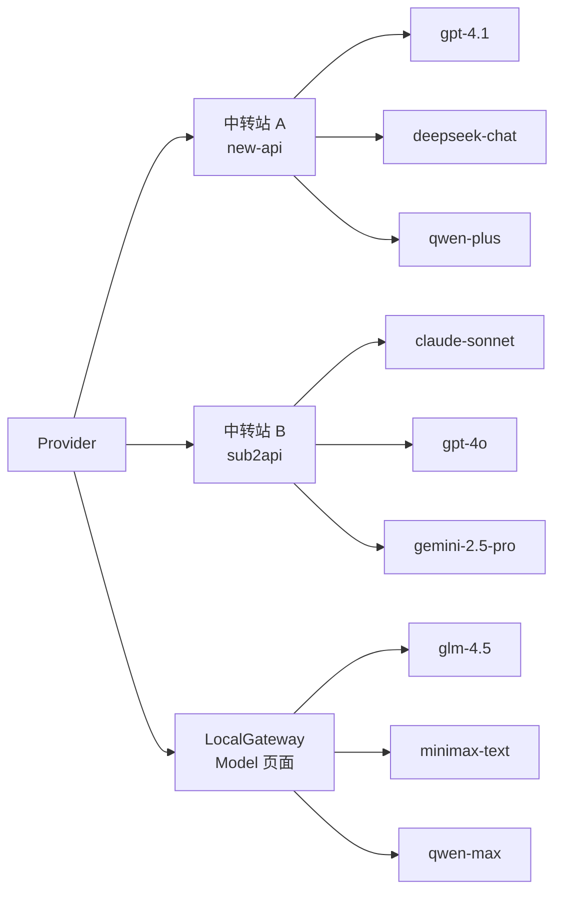

# Relay Switch 里的 Provider 和 Model 到底有什么区别？

为什么产品里同时有 Provider 页面和 Model 页面？

一句话解释: Provider 用来管理中转站， Model 页面就是一个运行在本地的中转站(LocalGateway)

架构上可以把它理解成这样：




这两个页面看起来都和“大模型”有关，但它们解决的问题其实不一样。

简单说：

Provider 是“我通过哪个 API 服务出去”。

Model 是“我本地有哪些原生模型来源可以统一管理”。

这两个概念如果不拆开，刚开始看会觉得简单，但产品用起来会越来越混乱。

举个例子。

假设你手上有一个中转 API 服务，比如基于 new-api、sub2api 之类框架搭建的中转站。

这个中转站可能已经帮你聚合好了很多模型：

```text
gpt-4.1
deepseek-chat
qwen-plus
claude-sonnet
```

这类东西在 Relay Switch 里更适合作为 Provider 管理。

因为你真正要切换的是“API 服务商”。

今天你想让 Codex、Claude Code、Cursor、Cherry Studio 都走 A 中转站。

明天 A 中转站不稳定了，你想切到 B 中转站。

如果每个工具都去改一遍 Base URL 和 API Key，会非常烦。

Relay Switch 的 Provider 页面就是解决这个问题的：

你让编程工具都连接 Relay Switch 本地地址，然后在 Relay Switch 里切 Provider。

工具不需要重启。

工具的配置文件也不需要每次都改。

这就是 Provider 的核心价值。

它管理的是“中转 API 服务”。

再看 Model 页面。

Model 页面不是用来替代 Provider 的。

它更像是用来管理“原生模型来源”的地方。

比如你希望直接接入 DeepSeek、MiniMax、Qwen、GLM 这类模型服务。

这些服务可能协议不完全一样，模型列表获取方式也不完全一样，能力字段也会有差异。

如果直接让每个编程工具分别去适配这些模型来源，复杂度很快就会爆炸。

所以 Relay Switch 里有一个 Local Gateway 的设计。

你可以先在 Model 页面添加这些原生模型来源。

然后 Relay Switch 会在本地维护一个 Local Gateway，把这些模型统一整理成 OpenAI-compatible 或 Anthropic-compatible 的访问方式。

之后你再回到 Provider 页面，启用 LocalGateway Provider。

这时候工具看到的还是一个稳定的 Provider。

但它背后实际管理的是你在 Model 页面添加的原生模型来源。

所以可以这样理解：

Provider 页面面向“工具接入”。

Model 页面面向“模型来源管理”。

Provider 解决的是：

```text
我的 Codex / Claude Code / Cursor 应该连到哪个 API 服务？
```

Model 解决的是：

```text
我本地想管理哪些原生模型来源，并通过 LocalGateway 统一暴露出去？
```

这也是为什么我们没有把所有东西都塞到一个页面里。

如果把 Provider 和 Model 混在一起，短期看页面少了，但长期会有几个问题。

第一，用户会分不清自己是在切中转站，还是在添加原生模型。

第二，第三方 relay provider 和原生模型服务的配置项不一样，强行放在一起会让表单越来越复杂。

第三，后续如果要给本地模型来源增加健康检查、模型同步、能力识别、可用模型筛选，这些逻辑会和 Provider 切换逻辑纠缠在一起。

所以我们选择把它们拆开。

Provider 页面更关注：

```text
Base URL
API Key
认证方式
当前启用哪个供应商
模型可用性检测
工具接入配置
```

Model 页面更关注：

```text
原生模型来源
模型列表
模型能力
LocalGateway 接入
后续对不同模型服务的适配
```

用户最常见的路径会是两种。

第一种：你已经有一个中转 API。

比如你有一个 new-api 或 sub2api 的站。

那你直接去 Provider 页面添加它就可以。

然后 Codex、Claude Code、Cursor、Cherry Studio 都连 Relay Switch 本地地址。

以后你切中转站，只需要在 Relay Switch 里切，不用改每个工具。

第二种：你想直接使用原生模型服务。

比如 DeepSeek、MiniMax、Qwen。

那你先去 Model 页面添加模型来源。

然后回到 Provider 页面启用 LocalGateway。

这时候工具还是只需要连接 Relay Switch。

背后的模型来源由 LocalGateway 统一管理。

这个设计不是为了增加概念，而是为了让后面继续扩展时不把系统做乱。

Relay Switch 的目标不是做一个“只能填 Base URL 的代理工具”。

它更像是本地 AI 工具的统一入口：

工具侧只配置一次。

Provider 可以切。

模型来源可以管。

本地网关可以统一协议。

历史请求和健康状态也能集中看。

所以 Provider 和 Model 的边界，我觉得可以用一句话总结：

Provider 是工具连接的出口。

Model 是模型来源的入口。

中间由 Relay Switch 和 LocalGateway 把它们接起来。

这样做的好处是，工具不用关心你后面到底换了哪个中转 API，也不用关心 DeepSeek、MiniMax、Qwen 各自有什么差异。

它只连一个稳定的本地地址。

剩下的都交给 Relay Switch。
